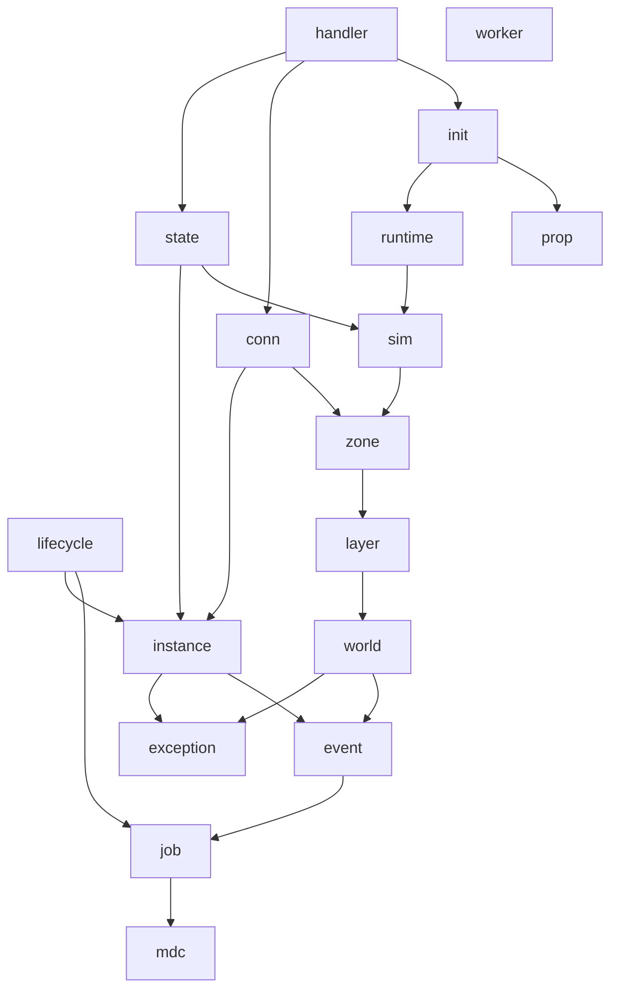

```mermaid
graph TD
    handler --> state
    handler --> conn
    handler --> init

    lifecycle --> instance
    lifecycle --> job

    init --> runtime
    init --> prop

    state --> instance
    state --> sim

    runtime --> sim

    conn --> instance
    conn --> zone

    sim --> zone

    zone --> layer

    layer --> world

    world --> exception
    world --> event

    instance --> exception
    instance --> event

    event --> job

    job --> mdc

    worker
```