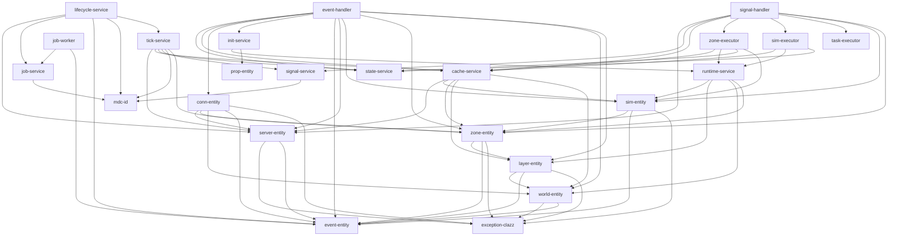

```mermaid
graph TD
    event-handler --> state-service
    event-handler --> cache-service
    event-handler --> conn-entity
    event-handler --> init-service
    event-handler --> event-entity
    event-handler --> server-entity
    event-handler --> sim-entity
    event-handler --> zone-entity
    event-handler --> world-entity
    event-handler --> layer-entity

    lifecycle-service --> server-entity
    lifecycle-service --> job-service
    lifecycle-service --> event-entity
    lifecycle-service --> mdc-id
    lifecycle-service --> tick-service

    init-service --> runtime-service
    init-service --> prop-entity

    cache-service --> server-entity
    cache-service --> sim-entity
    cache-service --> zone-entity
    cache-service --> layer-entity
    cache-service --> world-entity

    runtime-service --> sim-entity
    runtime-service --> layer-entity
    runtime-service --> world-entity
    runtime-service --> zone-entity

    conn-entity --> server-entity
    conn-entity --> zone-entity
    conn-entity --> world-entity
    conn-entity --> event-entity
    conn-entity --> exception-clazz

    sim-entity --> zone-entity
    sim-entity --> event-entity
    sim-entity --> exception-clazz

    zone-entity --> layer-entity
    zone-entity --> event-entity
    zone-entity --> exception-clazz

    layer-entity --> world-entity
    layer-entity --> event-entity
    layer-entity --> exception-clazz

    world-entity --> exception-clazz
    world-entity --> event-entity

    server-entity --> exception-clazz
    server-entity --> event-entity

    job-service --> mdc-id

    job-worker --> job-service
    job-worker --> event-entity

    sim-executor --> cache-service
    sim-executor --> runtime-service
    sim-executor --> state-service

    zone-executor --> cache-service
    zone-executor --> runtime-service
    zone-executor --> state-service
    zone-executor --> sim-entity

    signal-handler --> server-entity
    signal-handler --> signal-service
    signal-handler --> cache-service
    signal-handler --> zone-executor
    signal-handler --> sim-executor
    signal-handler --> task-executor
    signal-handler --> sim-entity
    signal-handler --> zone-entity

    signal-service --> mdc-id

    tick-service --> server-entity
    tick-service --> cache-service
    tick-service --> state-service
    tick-service --> signal-service
    tick-service --> mdc-id
    tick-service --> zone-entity
```
