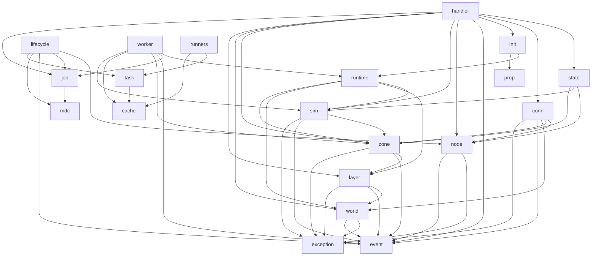

```mermaid
graph TD
    handler --> state
    handler --> conn
    handler --> init
    handler --> event
    handler --> node
    handler --> sim
    handler --> zone
    handler --> world
    handler --> layer
    handler --> job

    lifecycle --> node
    lifecycle --> job
    lifecycle --> event
    lifecycle --> mdc
    lifecycle --> task

    init --> runtime
    init --> prop

    state --> node
    state --> sim
    state --> zone

    runtime --> sim
    runtime --> layer
    runtime --> world
    runtime --> zone

    conn --> node
    conn --> zone
    conn --> world
    conn --> event
    conn --> exception

    sim --> zone
    sim --> event
    sim --> exception

    zone --> layer
    zone --> event
    zone --> exception

    layer --> world
    layer --> event
    layer --> exception

    world --> exception
    world --> event

    node --> exception
    node --> event

    job --> mdc

    worker --> runtime
    worker --> job
    worker --> event
    worker --> zone
    worker --> cache
    worker --> sim

    task --> cache

    runners --> task
    runners --> cache
```
