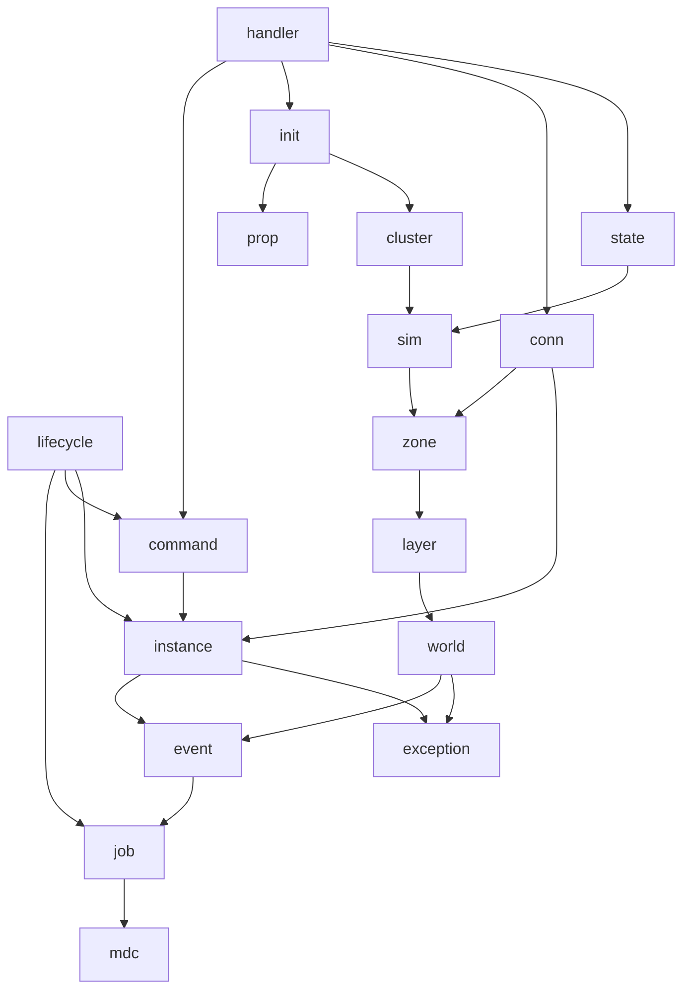

```mermaid
graph TD
    handler --> state
    handler --> conn
    handler --> init
    handler --> command

    lifecycle --> instance
    lifecycle --> command
    lifecycle --> job

    init --> cluster
    init --> prop

    state --> sim

    cluster --> sim

    conn --> instance
    conn --> zone

    command --> instance

    sim --> zone

    zone --> layer

    layer --> world

    world --> exception
    world --> event

    instance --> exception
    instance --> event

    event --> job

    job --> mdc
```