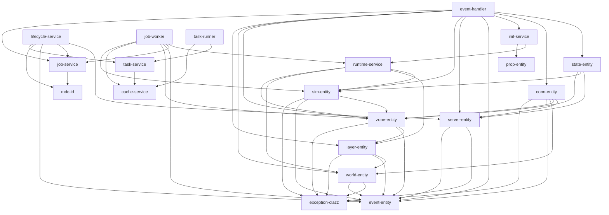

```mermaid
graph TD
    event-handler --> state-entity
    event-handler --> conn-entity
    event-handler --> init-service
    event-handler --> event-entity
    event-handler --> server-entity
    event-handler --> sim-entity
    event-handler --> zone-entity
    event-handler --> world-entity
    event-handler --> layer-entity
    event-handler --> job-service

    lifecycle-service --> server-entity
    lifecycle-service --> job-service
    lifecycle-service --> event-entity
    lifecycle-service --> mdc-id
    lifecycle-service --> task-service

    init-service --> runtime-service
    init-service --> prop-entity

    state-entity --> server-entity
    state-entity --> sim-entity
    state-entity --> zone-entity

    runtime-service --> sim-entity
    runtime-service --> layer-entity
    runtime-service --> world-entity
    runtime-service --> zone-entity

    conn-entity --> server-entity
    conn-entity --> zone-entity
    conn-entity --> world-entity
    conn-entity --> event-entity
    conn-entity --> exception-clazz

    sim-entity --> zone-entity
    sim-entity --> event-entity
    sim-entity --> exception-clazz

    zone-entity --> layer-entity
    zone-entity --> event-entity
    zone-entity --> exception-clazz

    layer-entity --> world-entity
    layer-entity --> event-entity
    layer-entity --> exception-clazz

    world-entity --> exception-clazz
    world-entity --> event-entity

    server-entity --> exception-clazz
    server-entity --> event-entity

    job-service --> mdc-id

    job-worker --> runtime-service
    job-worker --> job-service
    job-worker --> event-entity
    job-worker --> zone-entity
    job-worker --> cache-service
    job-worker --> sim-entity

    task-service --> cache-service

    task-runner --> task-service
    task-runner --> cache-service
```
